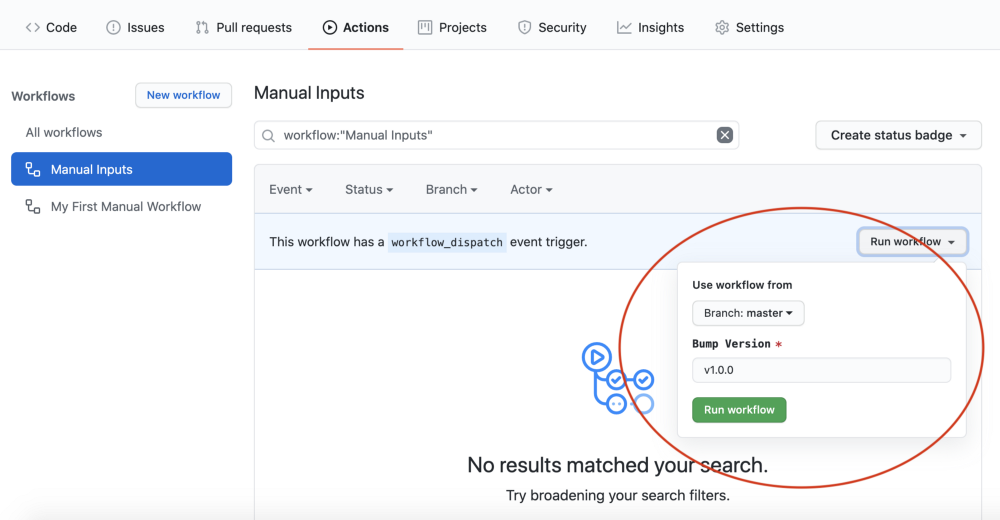
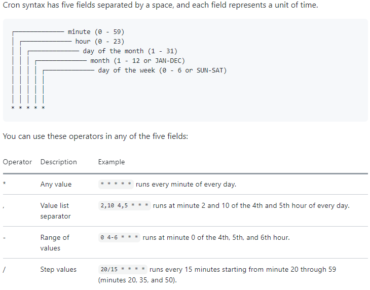

# Github Actions

## Overview
- GitHub Actions help to automate tasks within your software development life cycle. 
- GitHub Actions are event-driven, we can run a series of commands after a specified event has occurred.
  - **Examples:**
    - Executes a software testing script every time when team creates a pull request for a repository.
    - Deploy application using CI/CD when a code is checked-in to master branch.
- GitHub Actions will be registered using `*.yaml` file present in `<Repo>\.github/workflows`
- **Components of GitHub Actions**
  - GitHub Actions start with an event that automatically triggers the **workflow**,which contains a **job**. A job contains **steps** to control the order in which **actions** are run. These actions are the commands that are used to automate life cycle processes.
    - **Events:**
      - It is a specific activity that triggers a workflow.
      - These can be triggered manually. Once configured user can use `Repo -> Actions -> Workflow` to provide input and run the workflow.
        ```yaml
        name: Manual Inputs
        on: 
          workflow_dispatch:
            inputs:
              version:
                description: Version
                default: v1.0.0
                required: true
        ```
        
      - These can be triggered using Webhooks
      - These can also be scheduled.
        ```yaml
        name: Scheduled Workflow
        on:
          schedule:
            # * is a special character in YAML so you have to quote this string
            - cron:  '*/15 * * * *'
        ```
        
      - Complete list of events that can be used to trigger workflows are available (here)[https://docs.github.com/en/free-pro-team@latest/actions/reference/events-that-trigger-workflows].
    - **Workflows:**
      - Workflows are made up of one or more jobs and can be scheduled or triggered by an event.
      - Jobs can be configured to run sequentially or in parallel.